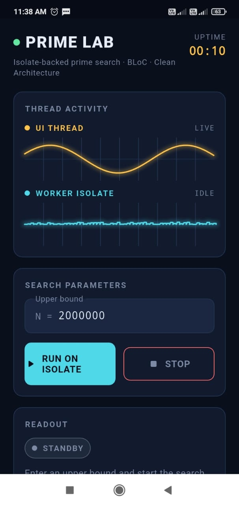
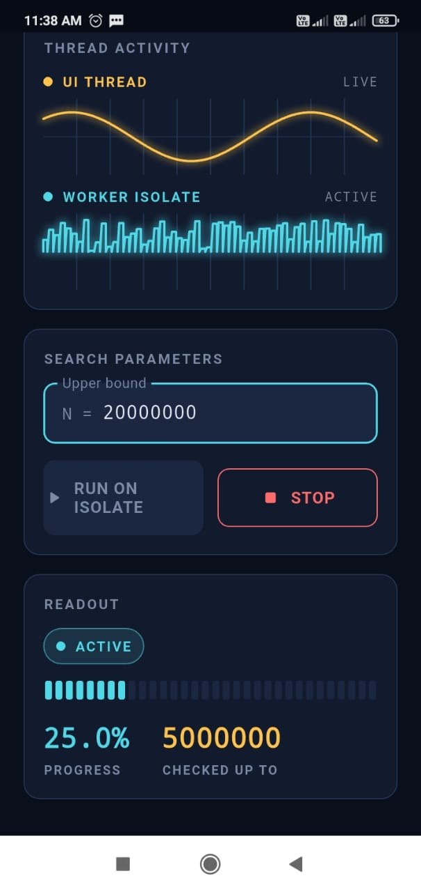
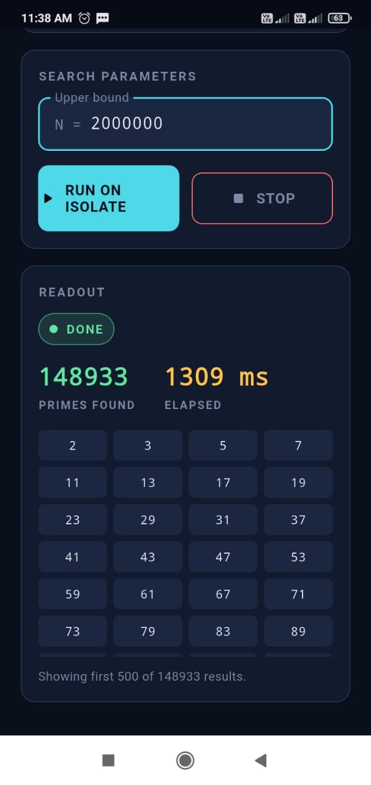

# Isolate + BLoC + Clean Architecture Demo

A small Flutter app built to demonstrate three things together:

1. **Clean Architecture** — clear separation between domain, data, and presentation.
2. **BLoC** — predictable, testable state management.
3. **Dart Isolates** — running CPU-heavy work off the UI thread, and proving it with a live "UI is alive" indicator that never stutters.

The app itself: enter a number `N`, and it finds every prime number up to `N` on a background isolate while the UI keeps rendering smoothly.

## Screenshots

    

## Why primes?

Prime search is a classic CPU-bound task (no `await`, no I/O — just tight loops), which makes it a good stand-in for anything that would otherwise freeze Flutter's single UI thread: image processing, JSON parsing of huge payloads, encryption, PDF generation, etc.

## Project structure

```
lib/
  core/
    isolate/
      isolate_manager.dart        # Reusable, generic isolate wrapper
    theme/
      app_theme.dart              # Palette + ThemeData for the instrument-panel look
    error/
      failures.dart
  features/
    prime_calculator/
      domain/                     # Pure Dart, no Flutter/isolate imports
        entities/
        repositories/             # Abstract contracts
        usecases/
      data/                       # Implementation details
        datasources/
          prime_isolate_datasource.dart   # <- the isolate entry point lives here
        repositories/
      presentation/
        bloc/
        pages/
        widgets/
          dual_trace_monitor.dart         # signature visual: UI thread vs worker isolate traces
          instrument_panel.dart           # reusable console "module" container
          status_pill.dart                # BLoC-state-driven status indicator
          labeled_stat.dart               # big monospace stat + caption
          segmented_progress_bar.dart     # LED-style segmented progress meter
  injection_container.dart        # get_it wiring
  main.dart
test/
  calculate_primes_test.dart      # domain layer test, no Flutter/isolate needed
  prime_bloc_test.dart            # bloc_test verifying state transitions
```

### Why this layering matters for isolates specifically

Isolate code is messy by nature — raw `SendPort`/`ReceivePort` plumbing, `Map<String, dynamic>` messages, manual (de)serialization. Clean Architecture gives that mess a single home:

- **`core/isolate/isolate_manager.dart`** — a small, reusable, feature-agnostic wrapper around `Isolate.spawn`. Handles the handshake (child isolate sends its `SendPort` back) and exposes a simple `send()` / `messages` API.
- **`data/datasources/prime_isolate_datasource.dart`** — the *only* file that defines the actual isolate entry point (`_primeIsolateEntryPoint`) and the message "protocol" (the `PrimeIsolateMessageKeys` map keys).
- **`data/repositories/prime_repository_impl.dart`** — converts raw messages into typed domain entities (`PrimeProgressUpdate`, `PrimeCalculationCompleted`).
- **`domain/`** — has zero knowledge that an isolate is involved. It just sees `Stream<PrimeCalculationEvent>`. You could swap the isolate implementation for `compute()`, a native FFI call, or a mocked stream in tests, and nothing above the data layer would need to change.
- **`presentation/bloc/prime_bloc.dart`** — consumes that stream with `emit.forEach`, no isolate awareness at all.

That's the payoff: the trickiest, most error-prone code (raw isolate messaging) is fully isolated (pun intended) to one file, and everything else is boring, testable Dart.

## The UI, and why it looks the way it does

The app is styled as a diagnostics console rather than a generic form-with-a-button, because the whole point of the demo is a fact about *time*, and that's easiest to show, not tell:

- **Thread activity panel** — a dual-trace oscilloscope-style readout. The amber **UI THREAD** lane is a perfectly smooth sine wave driven purely by a frame `Ticker`; the cyan **WORKER ISOLATE** lane is flat while idle and turns into a busy, spiky trace exactly when `PrimeCalculating` is the current BLoC state. Watch both at once: the UI lane never distorts, no matter how large `N` is, because it never has to share a thread with the search.
- **Search parameters panel** — the `N` input plus Run/Stop, wired straight to `PrimeBloc`.
- **Readout panel** — switches its whole contents based on the current `PrimeState` (`Standby` / `Active` with a segmented LED-style progress meter / `Done` with a monospace grid of primes / `Error` / `Stopped`), each with a matching color-coded status pill.
- A ticking **UPTIME** clock in the header is a second, simpler proof of the same idea — it keeps counting seconds on its own schedule the whole time a search is running.

Colors are meaningful, not decorative: amber always means "UI thread," cyan always means "worker isolate," across the trace lanes, the stats, and the status pills.

## How the isolate communication works

1. Main isolate creates an `IsolateManager` and calls `spawn(entryPoint)`.
2. `Isolate.spawn` starts `entryPoint` on a new isolate with its own memory heap — no shared state, no locks needed, no shared references possible.
3. The child isolate creates its own `ReceivePort` and immediately sends its `SendPort` back through the port it was given. This handshake is how the two isolates learn how to reach each other.
4. The main isolate calls `send({'limit': N})` to kick off the calculation.
5. The child isolate loops through numbers, checking primality, and periodically calls `mainSendPort.send({...})` with progress. It cannot touch any Flutter/UI state directly — it can only send messages.
6. When done, it sends one final `result` message and the main isolate's stream closes.
7. `IsolateManager.dispose()` kills the isolate (used both on natural completion and on manual cancel).

Only primitive values, `List`/`Map` of primitives, and a few special types (like `SendPort`) can cross the isolate boundary — this is why the protocol uses plain maps instead of custom classes.

## Running it

```bash
flutter pub get
flutter run
```

Try a large value like `20000000` and watch:

- The segmented LED-style progress meter fill up.
- The **WORKER ISOLATE** trace turn spiky and busy while the **UI THREAD** trace above it keeps tracing a perfectly smooth sine wave — proof the two are running independently.

If you move the prime loop out of the isolate and run it directly on the BLoC/UI thread instead, you'll see the UI THREAD trace freeze mid-wave — that's the whole point of the demo.

## Testing

```bash
flutter test
```

- `calculate_primes_test.dart` shows the domain layer can be tested with a fake repository — no isolates, no widgets.
- `prime_bloc_test.dart` uses `bloc_test` to assert exact state transitions.

## Key packages

| Package        | Purpose                                   |
|----------------|--------------------------------------------|
| `flutter_bloc` | State management                          |
| `equatable`    | Value equality for states/events/entities |
| `get_it`       | Simple service locator / DI               |
| `bloc_test`    | BLoC unit testing helpers                 |

## Extending this demo

- Swap the prime search for any other CPU-bound task by editing only `prime_isolate_datasource.dart` (the entry point + message keys) and the matching domain entities.
- Add a second isolate worker running in parallel by adding another `IsolateManager` instance — `IsolateManager` is fully reusable and feature-agnostic.
- Replace `get_it` with `RepositoryProvider`/`Provider` if you prefer widget-tree-based DI.
